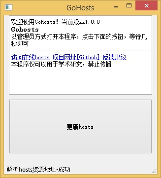

# GoHosts - Google Hosts

	通过修改hosts文件进行科学上网，相当简单！

* 本hosts仅限用于学术科研等正规用途，禁止传播
* hosts源虽然在更新，但用的人多了，也就不好用了，因此禁止传播
* 网站部署在SAE下，流量需要付费，所以还是禁止传播

## Qt制作的一键式程序

下载 https://github.com/baidut/GoHosts/releases



## 不想下载？访问在线hosts

1. 复制http://baidut.sinaapp.com/hosts.php 的内容
1. 替换系统的hosts文件

hosts文件位置
- Widonws系统 `系统盘:\windows\system32\drivers\etc\hosts`
- Linux/MAC系统 `/etc/hosts`
- Android系统 同Linux，需要ROOT

## 【Windows】找系统hosts文件麻烦？

1. 任意位置新建记事本，将下面的内容复制到记事本中
1. 把记事本后缀名改为bat
1. 以后以管理员账户打开该文件即可弹出系统hosts文件

```bat
notepad "%SystemRoot%\system32\drivers\etc\hosts"
ipconfig /flushdns
exit
```

## 【Windows】右键管理员身份运行比较麻烦？

1. 创建具有管理员权限的快捷方式，具体方法自行百度
1. 以后每次双击该快捷方式即可打开

## 注

- hosts文件资源来自：[谷友部落格](http://igge.gq/)
- Qt程序参考[/racaljk/hosts](https://github.com/racaljk/hosts)编写